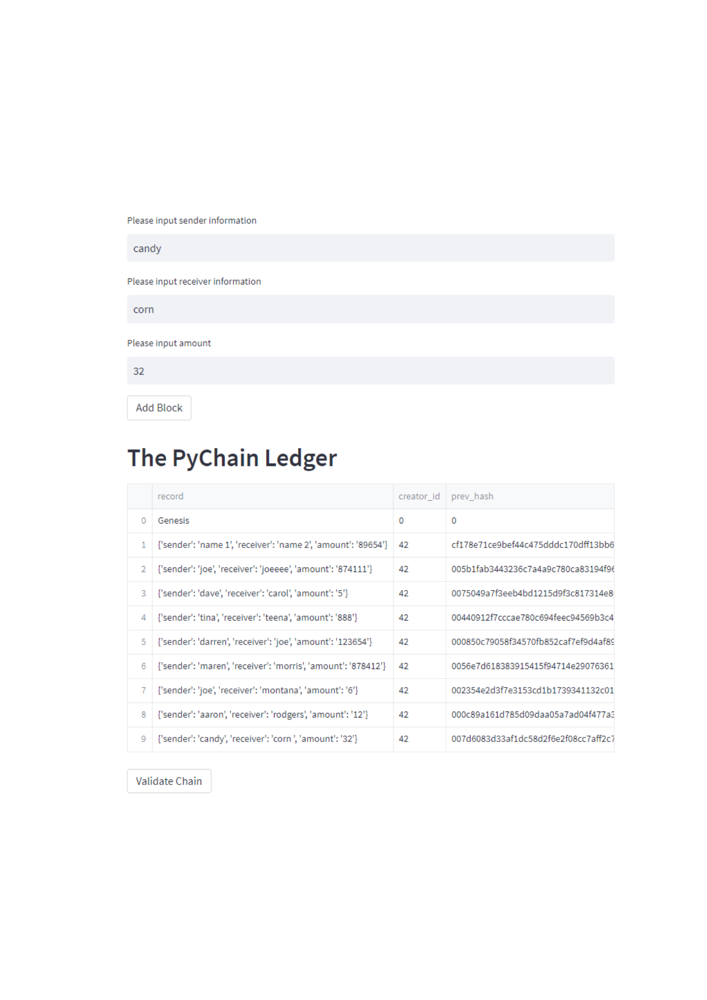
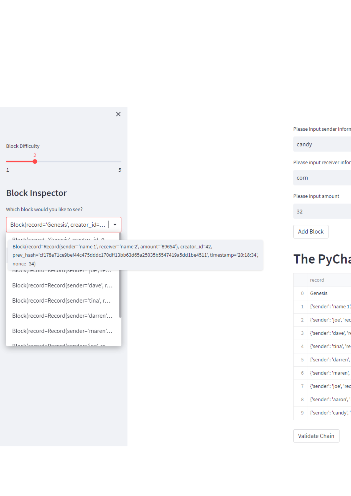

## PyChain

PyChain (stored as **pychain.py**) is a python application used to demonstrate blockchain logging.

**Example of blockchain with multiple blocks**

**Example of drop down window showing validity**

When extending the training window we experience a larger difference in results, first in a loss then a positive. Overall the longer training window gave us a much more successful result.

## Technologies

**pychain.py** is a python application. It leverages python 3.7 with the following packages:

* streamlit
* dataclasses import dataclass
* Any (from typing)
* List (from typing)
* datetime
* pandas
* hashlib

## Installation Guide

This file is accessible via Streamlit in your terminal. 

## Contributors

*Brought to you by Quianna Rolston*
> * [Email @ Quianna](quiannarolston@gmail.com)

> * [LinkedIn](https://www.linkedin.com/in/quianna-rolston/)

---

## License

UC Berkeley - FinTech Bootcamp '22